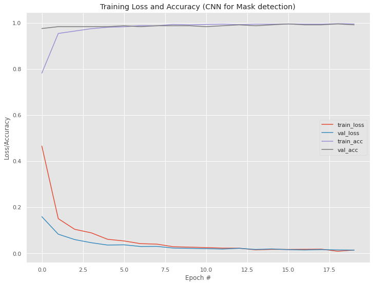
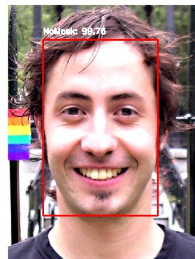

# Face Mask Detection using Deep Learning

## Overview

An end-to-end video-based Face Mask Recognition model was designed using Tensorflow ,OpenCV that detects faces in an image and recognizes whether the person is wearing a Face-Mask or not. We used the pre-trained Caffe Model provided in the `dnn` module in OpenCV for Face Detection and MobileNet V2 CNN model with some modifications for training. We achieved a 99.60% accuracy on the training set and a 99.20% accuracy on the test set. 

* The prime objective of training this particular model was the current impact of COVID-19 on public health and the importance of the usage of Face-Masks in times of come. 

## Preprocessing
The following preprocessing was applied to each image:

- Have trained the network on frontal face images
- Resized every image to 224 × 224 pixels from the input images of random sizes

## Model Description
For **Mask Reognition**, following are the details of the model: 

MobileNet V2 along with some incremental modifications : 
1. Max-Pool of 7 x 7
2. Fully connected layer of 128 neurons. Followed by Dropout of 0.5
3. Last layer maps to the 2 classes with softmax activation.
  
Trained with a learning rate of 0.01,Batch Size of 32 and with 20 to 40 epochs.
Used Adam optimizer with decay as the division of learning rate by the number of epochs
Used OpenCV for creating montages of the output and creating the blob for Face Detection.
Used Tensorflow's `ImageDataGenerator` feature for Data Augmentation for better results.

## Libraries Used
1.OpenCV 
2.Tensorflow 
3.Numpy 
4.Seaborn 
5.Matplotlib 
6.Pickle 
7.sklearn 

## Results

Training Accuracy : **99.60%**
Validation Accuracy : **99.20%**

---
<video src="MaskDetector.mp4" width="320" height="200" controls preload></video>

## Contributors
-Rohan Limaye: https://github.com/rylp  
-Rohan Naik: https://github.com/rohan-naik07 

