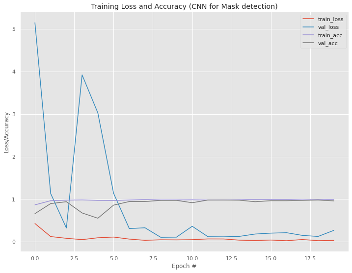
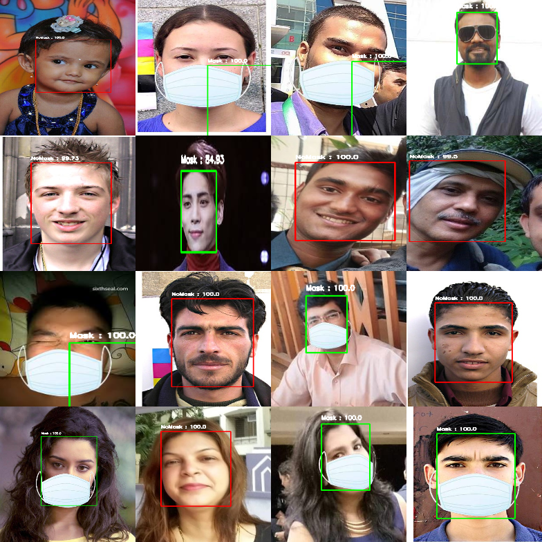
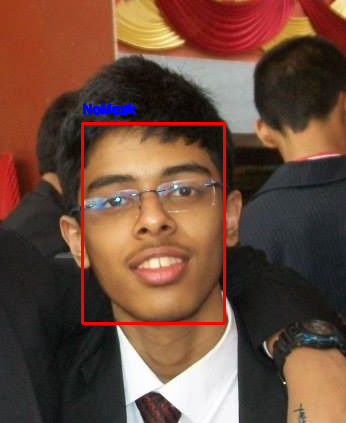
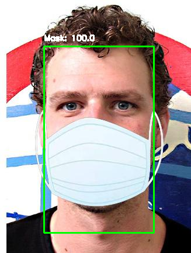
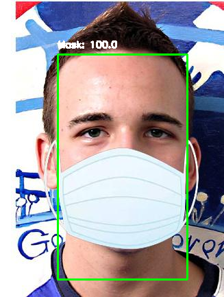

# Face Detection + Mask Recognition

## Overview

An end-to-end Face Detection plus Mask Recognition model was designed from scratch using OpenCV , the Keras framework and Deep Learning that detects faces in an image and recognizes whether the person is wearing a Face-Mask or not. We used the pre-trained Caffe Model provided in the `dnn` module in OpenCV for Face Detection and designed a Convolutional Neural Network for Mask Recognition using Keras for training. We achieved a 98.60% accuracy on the training set and a 98.30% accuracy on the test set.

* The prime objective of training this particular model was the current impact of COVID-19 on public health and the importance of the usage of Face-Masks in times of come. 

## Preprocessing
The following preprocessing was applied to each image:

- Have trained the network on frontal face images
- Resized every image to 64 × 64 pixels from the input images of random sizes

## Model Description
For **Mask Reognition**, following are the details of the model: 

1. 3x3 filter shape, 32 feature maps. Stride of 1 and same padding. Followed by: ReLU,Batch-Normalization,Max-Pool of 2,Dropout of 0.25
2. 3x3 filter shape, 64 feature maps. Followed by: Batch-Normalization
3. 3x3 filter shape, 64 feature maps,stride 1 and same padding. ReLU, Batch-Normalization,Max-Pool of size 2,Dropout of 0.25.
4. 3x3 filter shape, 128 feature maps. Followed by: Batch-Normalization
5. 3x3 filter shape, 128 feature maps. Followed by: Batch-Normalization
6. 3x3 filter shape, 128 feature maps,stride 1 and padding 1. ReLU, Batch-Normalization,Max-Pool of size 2,Dropout of 0.25.
7. Fully connected layer of 512 neurons. Followed by : ReLU,Batch Normalization, Dropout = 0.5. 
8. Another Fully connected layer of 128 neurons. Followed by : ReLU,Batch Normalization, Dropout = 0.5
9. Last layer maps to the 2 classes for Mask/No-Mask with softmax activation.
  
Trained with a learning rate of 0.01,Batch Size of 32 and with 20 to 40 epochs.
Used Adam optimizer with decay as the division of learning rate by the number of epochs
Used OpenCV for creating montages of the output and creating the blob for Face Detection.

## Libraries Used
1.OpenCV 
2.Tensorflow/Keras 
3.Numpy 
4.Seaborn 
5.Matplotlib 
6.Pickle 
7.sklearn 

## Results

Training Accuracy : **98.60%**
Validation Accuracy : **98.30%**

---

## Contributors
-Rohan Limaye: https://github.com/rylp  
-Rohan Naik: https://github.com/rohan-naik07 

